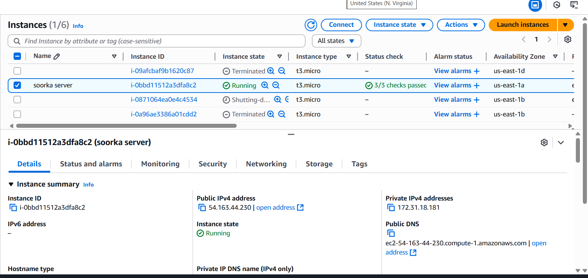
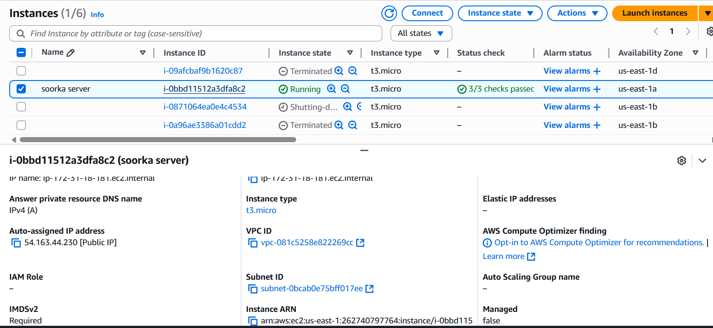
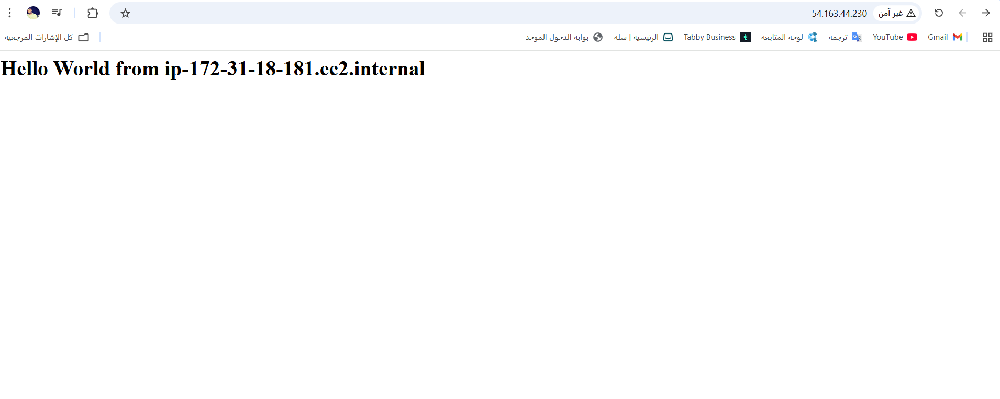
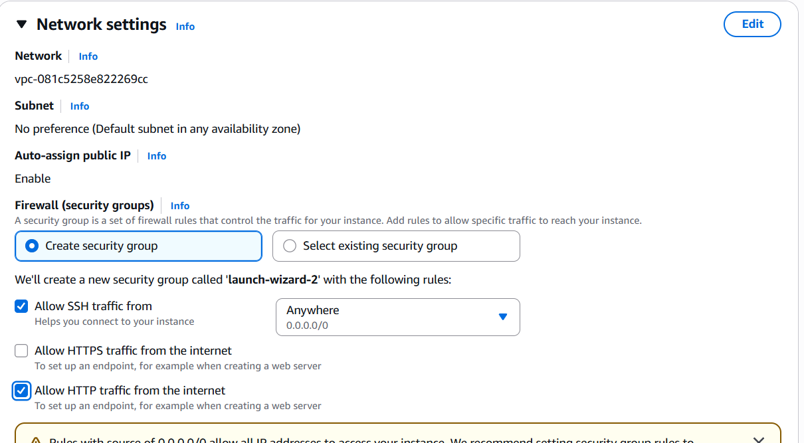
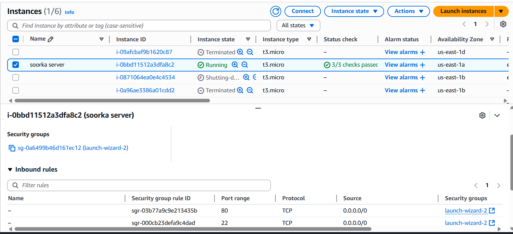
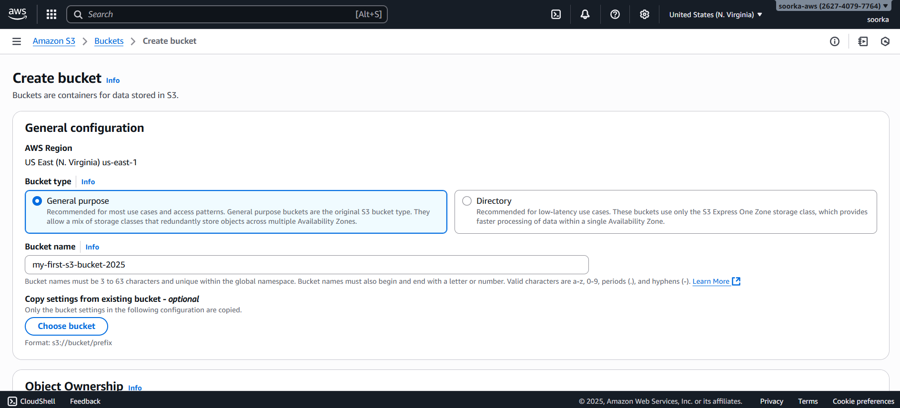
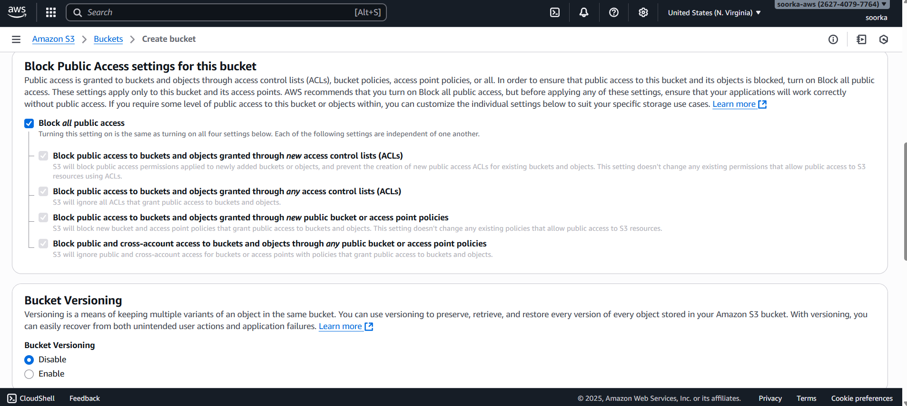
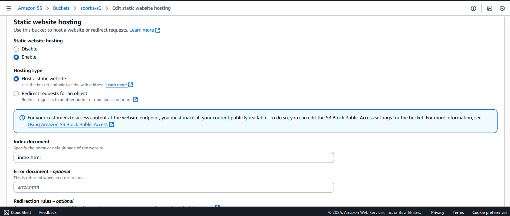
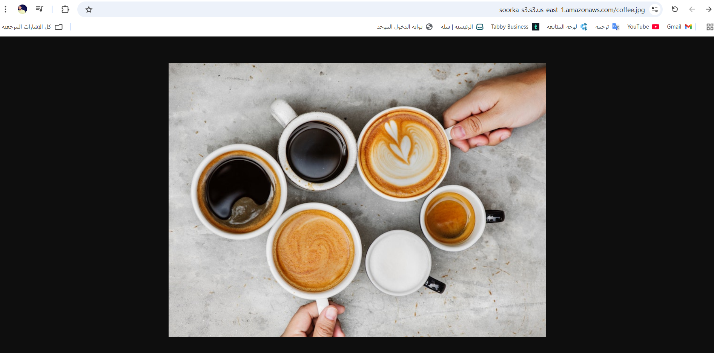

# ec2-first-project
Documentation of creating and running an EC2 server on AWS with practical screenshots.
# مشروع تشغيل سيرفر EC2 على AWS

## الهدف
إنشاء خادم (Server) باستخدام خدمة EC2 من AWS وتجهيزه بحيث يمكن الوصول له من المتصفح.

## الخطوات التي تم تنفيذها:
- إنشاء EC2 Instance
- اختيار نوع الإنستانس (مثل t3.micro)
- ضبط Security Group وفتح منفذ 80
- تشغيل السيرفر والتأكد أن حالته Running
- نسخ الـ Public IP وتجربته في المتصفح

## لقطات الشاشة

### ✅ 1) السيرفر شغال وفيه الـ Public IP

### ✅ 2) نوع الإنستانس المستخدم (اختياري)

### ✅ 3) فتح الموقع من المتصفح

ملاحظات
- إذا لم يفتح الموقع، غالبًا المنفذ 80 غير مفعَّل في Security Group.
- مهم حذف أو إيقاف الموارد بعد الانتهاء لتجنب أي تكلفة على الحساب.
---

### 🛡️ Security Group Configuration

#### أثناء إنشاء الـEC2

#### بعد تشغيل الـEC2

## 🟠 S3 Static Website Hosting

### 1. إنشاء البكت

### 2. إعدادات Public Access

### 3. تفعيل Static Website Hosting

### 4. صفحة الموقع بعد التشغيل

